

或是<a href="https://testflight.apple.com/join/TDrhSSs0" target="_blank">加入測試計畫</a>

# 操作手冊
[登入畫面](./docs/login_page.md#登入畫面)  
[連線畫面](./docs/connecting_page.md#連線畫面)  
[主畫面](./docs/page_view.md#主畫面)  
[工具列](./docs/toolbar.md#工具列)  
[看板列表](./docs/boards_page.md#看板列表)  
[看板選項](./docs/board_options.md#看板選項)  
[最愛看板排序](./docs/favorites_sorting.md#最愛看板排序)  
[信件列表](./docs/mails_page.md#信件列表)  
[信件選項](./docs/mail_options.md#信件選項)  
[話題功能](./docs/topics.md#話題功能)  
[話題列表](docs/topics_page.md#話題列表)  
[延燒話題選項](./docs/topic_options.md#延燒話題選項)  
[延燒話題設定](./docs/topic_settings.md#延燒話題設定)  
[編輯隱藏看板](./docs/hidden_boards.md#編輯隱藏看板)  
[關注話題選項](./docs/subs_topic_options.md#關注話題選項)  
[關注話題設定](./docs/subs_topic_settings.md#關注話題設定)  
[編輯關注看板](./docs/subs_boards.md#編輯關注看板)  
[閱讀紀錄](./docs/records_page.md#閱讀紀錄)  
[閱讀紀錄分類](./docs/record_categories.md#閱讀紀錄分類)  
[閱讀紀錄顯示方式](./docs/records_group.md#閱讀紀錄顯示方式)  
[刪除閱讀紀錄](./docs/delete_records.md#刪除閱讀紀錄)  
[最近造訪](./docs/top_boards.md#最近造訪)  
[最近造訪選項](./docs/top_board_options.md#最近造訪選項)  
[刪除最近造訪](./docs/delete_top_boards.md#刪除最近造訪)  
[最近造訪排序](./docs/top_boards_sorting.md#最近造訪排序)  
[分類看板](#分類看板)  
[鄉民名冊](#鄉民名冊)  
[名冊選項](#名冊選項)  
[水球聊天](#水球聊天)  
[文章列表](#文章列表)  
[文章列表功能](#文章列表功能)  
[文章列表選項](#文章列表選項)  
[搜尋文章分頁](#搜尋文章分頁)  
[搜尋文章](#搜尋文章)  
[搜尋文章代碼](#搜尋文章代碼)  
[刪除搜尋文章紀錄](#刪除搜尋文章紀錄)  
[文章資訊](#文章資訊)  
[轉錄](#轉錄)  
[樂透](#樂透)  
[看板設定](#看板設定)  
[轉寄](#轉寄)  
[驗證碼](#驗證碼)  
[使用者資訊](#使用者資訊)  
[縮網址](#縮網址)  
[搜尋看板](#搜尋看板)  
[文章內容](#文章內容)  
[文章內容功能](#文章內容功能)  
[推文項目](#推文項目)  
[推文選項](#推文選項)  
[預覽項目](#預覽項目)  
[預覽項目選項](#預覽項目選項)  
[網址項目](#網址項目)  
[網址項目選項](#網址項目選項)  
[文章代碼項目](#文章代碼項目)  
[剪貼簿](#剪貼簿)  
[文章內容瀏覽模式](#文章內容瀏覽模式)  
[推文頁面](#推文頁面)  
[大圖瀏覽](#大圖瀏覽)  
[精華區列表](#精華區列表)  
[精華區選項](#精華區選項)  
[精華區路徑](#精華區路徑)  
[主選單頁面](#主選單頁面)  
[帳號選項](#帳號選項)  
[發表文章](#發表文章)  
[回覆文章](#回覆文章)  
[編輯簽名檔](#編輯簽名檔)  
[編輯文章](#編輯文章)  
[從暫存檔恢復](#從暫存檔恢復)  

# 問與答
[簡介](#簡介)  
[連線方式](#連線方式)  
[無法登入](#無法登入)  
[連線緩慢](#連線緩慢)  
[樓層數消失](#樓層數消失)  
[點擊文章與進入文章不符](#點擊文章與進入文章不符)  
[回覆推文](#回覆推文)  
[發文或推文出現亂碼](#發文或推文出現亂碼)  
[實名發布](#實名發布)  
[信件通知](#信件通知)  
[無法開啟測試版本](#無法開啟測試版本)  
[封鎖樣式](#封鎖樣式)  
[點擊狀態列不會回到頂部](#點擊狀態列不會回到頂部)  

## 分類看板

  

1. ### 分類看板項目
點擊後進入分類

[返回頁首](#操作手冊) 

## 鄉民名冊

   

1. ### 搜尋鄉民
輸入鄉民完整ID查詢鄉民資訊

2. ### 鄉民ID
加入名冊內的鄉民帳號

3. ### 最近訊息
水球聊天記錄內的最新訊息

4. ### 訊息時間
水球聊天記錄內的最新訊息時間

5. ### 未讀訊息數
尚未閱讀的訊息數量

6. ### 名冊項目
點擊可開啟水球聊天頁面，長按可顯示名冊選項  
  
[返回頁首](#操作手冊) 

## 名冊選項

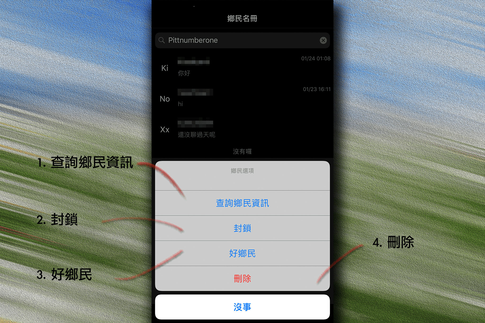 

1. ### 查詢鄉民資訊
點擊後將顯示鄉民資訊頁

2. ### 封鎖
將作者加入封鎖名單，所有文章、信件、推文、水球以及話題皆會被封鎖，被封鎖的項目會顯示為淡化項目  
此處之所以不完全隱藏項目，是為避免造成 App 有刻意隱藏特定資訊的疑慮  
所有封鎖項目皆可隨時查閱或解除封鎖

3. ### 好鄉民
將作者加入好鄉民名單，推文前方將顯示愛心圖示，同時加入封鎖及好鄉民表示為超級好友，除了不會顯示為封鎖狀態外，推文前方將顯示特殊圖示。

4. ### 刪除
將鄉民從名冊內刪除，一併刪除水球紀錄  
  
[返回頁首](#操作手冊) 

## 水球聊天

水球聊天為 PTT 內建聊天功能，由於架構較老舊，對於傳送訊息方面有些許限制

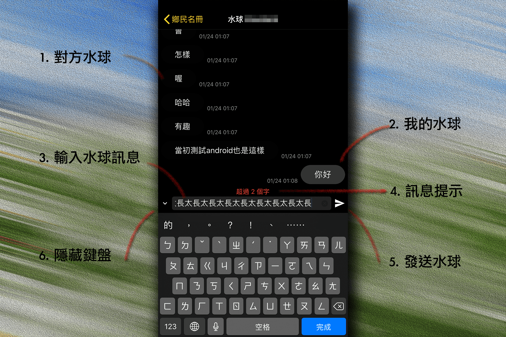   

1. ### 對方水球
對方傳送的水球訊息與時間

2. ### 我的水球
我傳送的水球訊息與時間

3. ### 輸入水球訊息
可輸入水球訊息

4. ### 訊息提示
水球訊息長度最大為 54 （中文長度為 2），超過此長度將無法傳送並顯示超過多少字元

5. ### 發送水球
點擊後送出水球，若對方已下線則無法傳送

6. ### 隱藏鍵盤
點擊後隱藏鍵盤  
  
[返回頁首](#操作手冊) 

## 文章列表

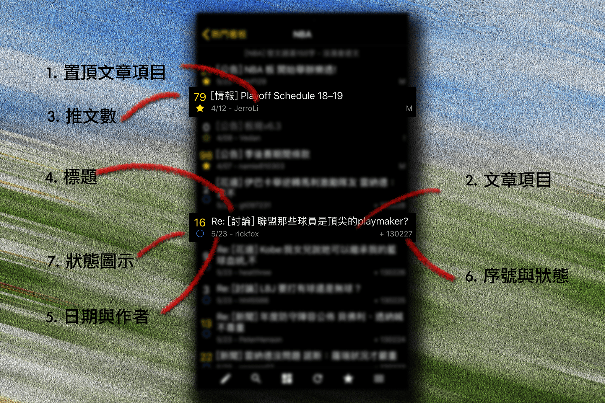   

1. ### 置頂文章項目
看板內的置頂（置底）文，點擊進入文章，長按顯示文章選項

2. ### 文章項目
看板內的文章，點擊進入文章，長按顯示文章選項

3. ### 推文數
文章的推文數，推文數較多則顯示為 1~99，超過將顯示為「爆」  
噓文數較多則顯示為X1~X9，每十則噓文進位一次，超過 99 則需文將顯示為「XX」 
計算方式為總推文數 - 總噓文數，正數顯示為推文數，負數顯示為噓文數

4. ### 標題
文章標題，有長度限制，多餘的部分將被刪減，進入內文後才會顯示完整標題 
前方的 [] 文字為文章分類，分類前方的文字則代表文章類型  
Re: 代表回文，Fw: 代表轉錄，Lk: 代表鎖文

5. ### 日期與作者
發文日期與作者

6. ### 序號與狀態
文章序號與文章狀態，其中序號非固定值，可能會因為刪文、搜尋結果改變而變動  
文章狀態有以下幾種：  
  
* "+" 未讀
* "~" 已讀但有新推文/經過編輯
* " " 已讀
* "M" 未讀且被板主標記，被標記的文章不會被系統清除
* "=" 已讀但有新推文/經過編輯且被板主標記
* "m" 已讀且被板主標記
* "!" 鎖文
* "S" 未讀且被板主標記
* "s" 已讀且被板主標記
* "D" 使用者標記
* "*" 已收錄到文摘，僅板主可見  

7. ### 狀態圖示
根據文章狀態顯示的圖示，  
置頂（置底）文以星號顯示，實心為未讀文章，空心為已讀文章，綠色空心為已讀但有新推文/經過編輯  
一般文章以圓圈顯示，藍色為未讀文章，灰色為已讀文章，綠色為已讀但有新推文/經過編輯  
  
[返回頁首](#操作手冊) 

## 文章列表功能

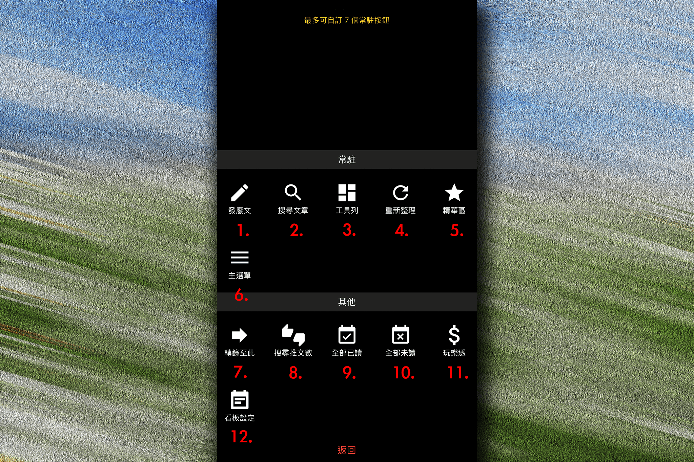   

1. ### 發廢文
發表文章功能，請先閱讀置底板規，以免被水桶

2. ### 搜尋文章功能
可搜尋文章標題、作者與推文數 
比對方式皆為「包含」，因此搜尋作者時不會只有該作者的文章

3. ### 展開工具列
點擊後可展開工具列，可進行排序與其他操作

4. ### 重新整理
點擊後重新整理文章列表

5. ### 精華區
點擊後進入精華區

6. ### 主選單
點擊後進入主選單

7. ### 轉錄至此
須先到文章內使用「轉錄文章」功能，再到欲轉錄看板內使用此功能，即可將該篇文章轉錄至此

8. ### 搜尋推文數
快速鍵，點擊後開啟搜尋文章頁面並自動移動至搜尋推文數分頁

9. ### 全部已讀
將此看板所有文章設為已讀

10. ### 全部未讀
將此看板所有文章設為未讀

11. ### 玩樂透
點擊後開啟樂透頁面

12. ### 看板設定功能
點擊後開啟看板設定檢視頁面，可查看此看板相關設定以及是否有發文權限  
  
[返回頁首](#操作手冊) 

## 文章列表選項

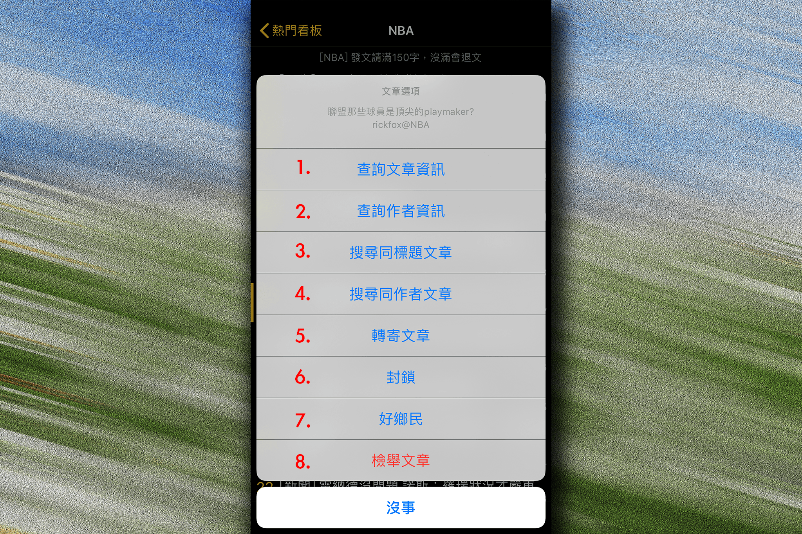 
  
1. ### 查詢文章資訊
點擊後顯示文章資訊頁面

2. ### 查詢作者資訊
點擊後顯示作者資訊頁面

3. ### 搜尋同標題文章
點擊後將以此文章標題搜尋文章，PTT 站台的搜尋為「包含」方式，因此若出現類似標題也屬於正常結果

4. ### 搜尋同作者文章
點擊後將以此作者搜尋文章，PTT 站台的搜尋為「包含」方式，因此若出現其他作者文章也屬於正常結果

5. ### 轉寄文章功能
點擊後將顯示轉寄頁面，可將文章轉寄給自己、其他鄉民或外部信箱。

6. ### 封鎖
將作者加入封鎖名單，所有文章、信件、推文、水球以及話題皆會被封鎖，被封鎖的項目會顯示為淡化項目  
此處之所以不完全隱藏項目，是為避免造成 App 有刻意隱藏特定資訊的疑慮  
所有封鎖項目皆可隨時查閱或解除封鎖

7. ### 好鄉民
將作者加入好鄉民名單，推文前方將顯示愛心圖示，同時加入封鎖及好鄉民表示為超級好友，除了不會顯示為封鎖狀態外，推文前方將顯示特殊圖示。

8. ### 檢舉文章
將違規文章通報給板主，將會自動進入發信頁面並自動帶入檢舉表單與檢舉對象，若文章所在看板沒有板主將僅顯示至 Violation 看板檢舉提示。  
  
[返回頁首](#操作手冊) 

## 搜尋文章分頁

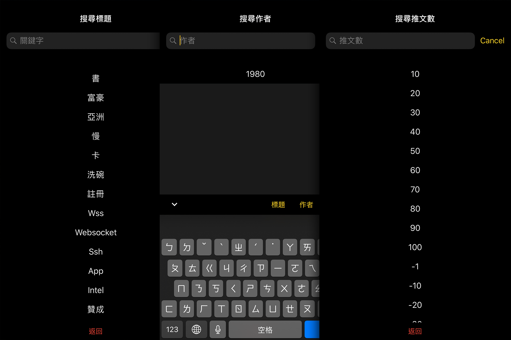 

共有三種分頁，四種搜尋功能，使用左右滑動切換頁面可操作搜尋紀錄，只有推文數列表為固定值供快速搜尋用  
  
* 搜尋標題  
* 搜尋作者
* 搜尋推文數
* 搜尋文章代碼（直接輸入#自動切換） 
  
[返回頁首](#操作手冊) 

## 搜尋文章

 

1. ### 輸入關鍵字
可輸入標題關鍵字、作者ID或推文數搜尋

2. ### 取消搜尋
點擊後取消搜尋並離開此頁面

3. ### 搜尋紀錄
點擊可快速搜尋，長按可刪除搜尋紀錄，點擊後的搜尋類型為目前頁面類型

4. ### 隱藏鍵盤
點擊後隱藏鍵盤

5. ### 搜尋標題
點擊後以輸入的關鍵字搜尋標題，忽略目前頁面類型

6. ### 搜尋作者
點擊後以輸入的關鍵字搜尋作者，忽略目前頁面類型

7. ### 搜尋推文數
點擊後以輸入的推文數搜尋，忽略目前頁面類型

8. ### 搜尋
點擊後以輸入的關鍵字搜尋，搜尋類型為目前頁面類型  
  
[返回頁首](#操作手冊) 

## 搜尋文章代碼

 

1. ### 輸入文章代碼
在關鍵字輸入區輸入 # 後將自動轉換為搜尋文章代碼模式

2. ### 搜尋
點擊後以文章代碼進入文章  
  
[返回頁首](#操作手冊) 

## 刪除搜尋文章紀錄

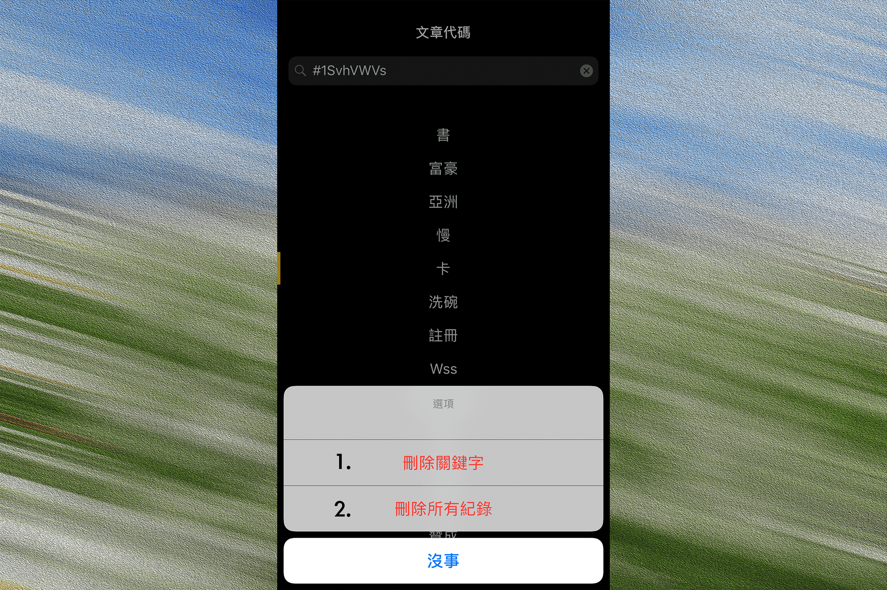 

1. ### 刪除關鍵字
刪除選擇的紀錄

2. ### 刪除所有紀錄
刪除目前搜尋類型的所有搜尋紀錄  
  
[返回頁首](#操作手冊) 

## 文章資訊

 

1. ### 文章標題
查詢的文章標題

2. ### 文章作者
查詢的文章發佈作者

3. ### 文章日期
查詢的文章發佈日期

4. ### 文章代碼
查詢的文章代碼，可使用此代碼快速進入文章

5. ### 文章連結
查詢的文章 Web 版連結

6. ### 文章價值
查詢的文章價值，只有 1P 幣以上才被計算為有效文章  
  
[返回頁首](#操作手冊) 

## 轉錄

轉錄前請詳閱注意事項並注意板規與站規

 

1. ### 轉錄目標看板
文章/信件將轉錄至此看板

2. ### 轉錄文章標題
欲轉錄的文章/信件標題

3. ### 轉錄來源作者
欲轉錄的文章作者/寄件者

4. ### 轉錄來源看板
欲轉錄的文章所在看板/信件序號

5. ### 取消轉錄
取消轉錄並離開頁面

6. ### 確定轉錄
將文章轉錄至此看板  
  
[返回頁首](#操作手冊) 

## 樂透

  
 
   

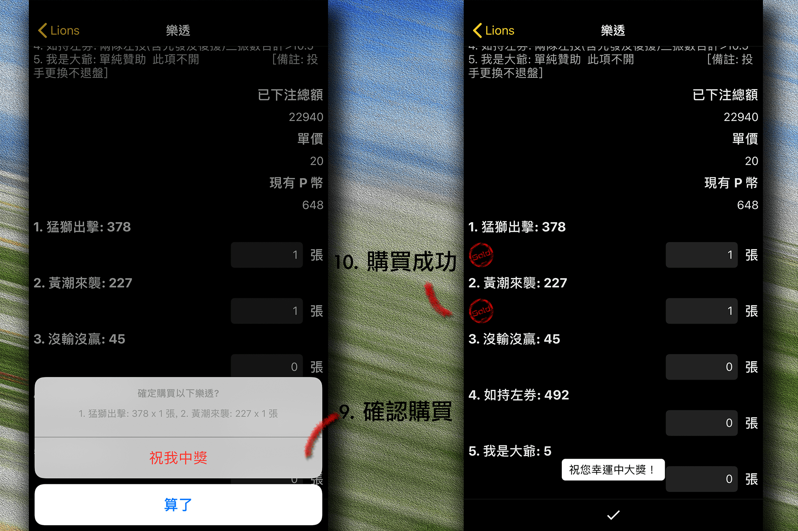   

1. ### 站規
樂透全站規則

2. ### 自訂規則及說明
樂透玩法

3. ### 已下注總額
目前樂透的下注總額

4. ### 單價
每一注樂透的單價

5. ### 現有批幣
目前擁有的 Ptt 幣

6. ### 選項
樂透項目名稱及下注總數

7. ### 確認購買
點擊後顯示確認下注選項

8. ### 購買張數
欲下注的數量

9. ### 再次確認購買
顯示總下注項目與數量，點擊後確定下注

10. ### 購買成功
購買成功項目將顯示已賣出圖示，若欲再次購買請離開後再次進入樂透頁面  
  
[返回頁首](#操作手冊) 

## 看板設定

   

1. ### 板標
看板描述

2. ### 板主名單
此看板的板主

3. ### 看板人氣
目前此看板的瀏覽人數

4. ### 發文與推文限制
若有不符合的項目將顯示為紅色文字，發文或推文前請確認是否符合此限制

5. ### 其他
此看板的其他設定  
  
[返回頁首](#操作手冊) 

## 轉寄

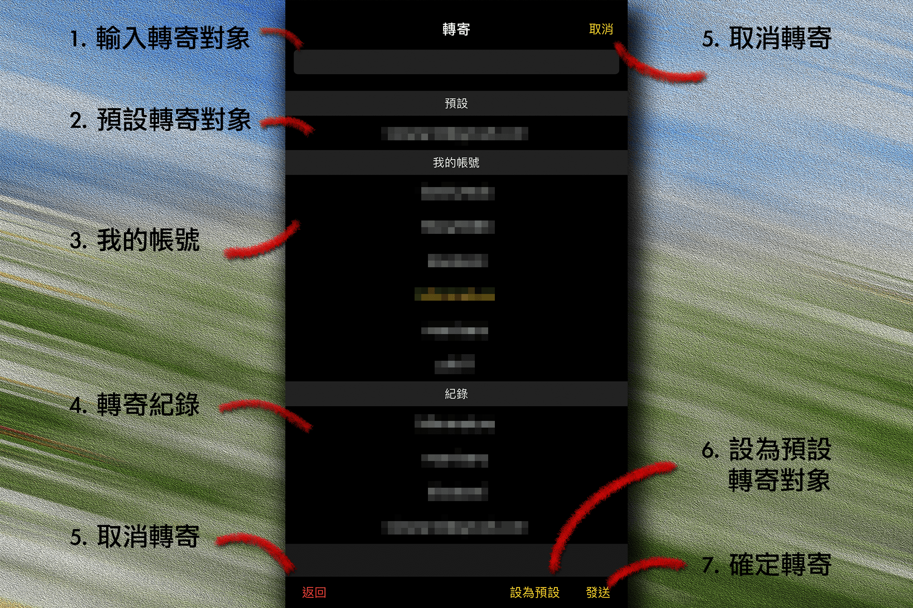   

1. ### 輸入轉寄對象
可輸入外部信箱位址或鄉民 ID

2. ### 預設轉寄對象
可設定一個目標

3. ### 我的帳號
PiTT 紀錄的帳號，目前登入帳號將顯示為突顯顏色

4. ### 轉寄紀錄
長按可刪除紀錄

5. ### 取消轉寄
離開轉寄頁面

6. ### 設為預設轉寄對象
將目前輸入的外部信箱位址或鄉民 ID 設為預設轉寄對象

7. ### 確定轉寄
轉寄至信箱  
  
[返回頁首](#操作手冊) 

## 驗證碼

在某些情況下將顯示此頁面避免機器人自動操作造成站台負載過高(如：連續轉寄)

   

1. ### 輸入驗證碼
輸入下方看見的驗證碼

2. ### 驗證碼區域
大寫英文字，共六碼

3. ### 略過驗證碼
點擊後將重新連線以繞過驗證碼，但若再次操作轉寄功能還是會再次出現，  
直到通過驗證為止

4. ### 送出
送出驗證  
  
[返回頁首](#操作手冊) 

## 使用者資訊

   

1. ### ID暱稱
查詢的使用者帳號與暱稱

2. ### 自訂別名
可輸入最多12個字元長度（中文長度為2）的自訂別名，將替代原帳號顯示於推文  
未來將支援至文章列表與話題列表

3. ### 經濟狀況
目前使用者的批幣多寡，只有本人可以看到實際數量

4. ### 登入次數
目前使用者的登入次數

5. ### 有效文章
目前使用者的有效文章數量，價值1P幣以上的文章才計入一篇

6. ### 目前動態
目前使用者的概略動態，如閱讀文章、文章列表等等，不會顯示實際動態

7. ### 私人信箱
目前使用者是否有信件未讀

8. ### 上次上站
目前使用者的上次上站時間

9. ### 上次故鄉
目前使用者的上次上站 IP 位址

10. ### 五子棋
目前使用者的五子棋戰績（目前僅電腦版可遊玩五子棋）

11. ### 象棋戰績
目前使用者的象棋戰績（目前僅電腦版可遊玩象棋）

12. ### 個人名片
目前使用者的個人名片  
  
[返回頁首](#操作手冊) 

## 縮網址

 

1. ### 輸入網址
想要縮短的網址

2. ### 縮網址項目
點擊插入縮網址，長按可選擇要複製至剪貼簿或插入縮網址

3. ### 原始網址
縮網址的原始網址

4. ### 縮網址　
縮短的網址  
  
[返回頁首](#操作手冊) 

## 搜尋看板

 

1. ### 搜尋關鍵字
可搜尋看板名稱或以關鍵字搜尋，由於看板名稱僅限英文、數字及部分符號，  
若輸入其它字元將自動切換至搜尋關鍵字

2. ### 搜尋結果
操作方式詳見[最近造訪](#最近造訪)以及[看板列表](#看板列表)

3. ### 切換搜尋目標
可切換至搜尋看板名稱或關鍵字  
  
[返回頁首](#操作手冊) 
  
## 文章內容

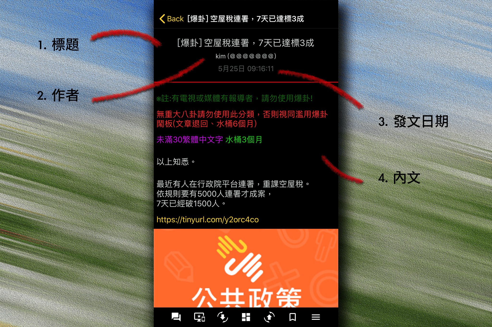 

1. ### 標題
文章內文標題，編輯時不會與列表標題同步更新，同時也會顯示比列表標題更多的字數

2. ### 作者
文章作者與暱稱

3. ### 發文日期
若為今年的文章將不顯示年份

4. ### 內文
文章內容  
  
[返回頁首](#操作手冊) 

## 文章內容功能

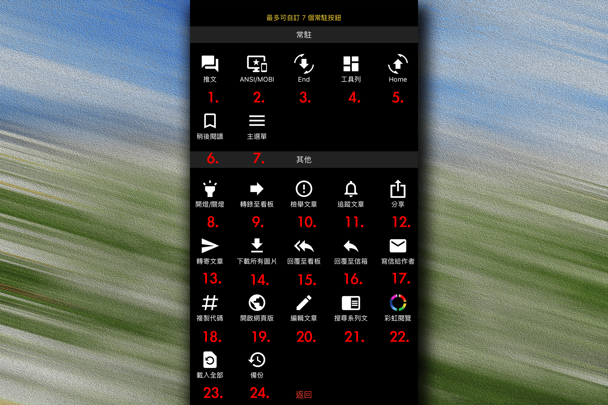 

1. ### 推文
開啟推文介面

2. ### ANSI/MOBI
點擊切換 ANSI 模式與 MOBI 模式

3. ### End
等同電腦版鍵盤的 End 按鍵，點擊後將在重新整理後從文章最末頁往上載入

4. ### 工具列功能
點擊後展開工具列，可設定常駐按鈕與排序

5. ### Home
等同電腦版鍵盤的 Home 按鍵，點擊後將在重新整理後從文章第一頁往下載入

6. ### 稍後閱讀
點擊後將此文章加入稍後閱讀，可在閱讀紀錄頁隨時查看

7. ### 主選單
點擊後開啟主選單

8. ### 開燈/關燈
開燈為 PTT 術語，表示將隱藏的文字顯示出來的一種動作，    
此功能實際上為顯示純文字裝態的內容，不套用色碼，  
因此若以黑色隱藏的字元將會顯示出來，  
關燈則是相反的動作，將套用色碼顯示

9. ### 轉錄至看板
準備將本文章轉錄至其他看板，搭配文章列表的轉錄至此功能使用

10. ### 檢舉文章
將違規文章通報給板主，將會自動進入發信頁面並自動帶入檢舉表單與檢舉對象，若文章所在看板沒有板主將僅顯示至 Violation 看板檢舉提示。  

11. ### 追蹤文章
將在文章有異動或有新推文時推播通知，此功能由 PiTT 伺服器負責處理，  
PiTT 不會在背景自動登入進行任何操作

12. ### 分享
以網址方式分享文章

13. ### 轉寄文章功能
點擊後將顯示轉寄頁面，可將文章轉寄給自己、其他鄉民或外部信箱。

14. ### 下載所有圖片
將已載入頁面的所有圖片連結下載至裝置

15. ### 回覆至看板
一般回文功能，預設將發佈相同標題的新文章至看板

16. ### 回復至信箱
一般回信功能，預設將發送相同標題的信件給看板列表顯示的作者

17. ### 寫信給作者
由 App 自動帶入收件者、標題等其他資訊的寄發新信件功能，    
主要用途為當文章被鎖文時無法回信可使用此功能代替，  
或是當內文作者與文章列表作者不同時也可以此功能寫信給內文作者。

18. ### 複製代碼
複製文章代碼（包含看板）

19. ### 開啟網頁版
開啟此文章的網頁版

20. ### 編輯文章功能
進入編輯文章介面，只有文章作者可以操作

21. ### 搜尋系列文
搜尋本文章的系列文

22. ### 彩虹閱覽
特殊瀏覽模式，將由系統自動將文字上色

23. ### 載入全部
自動由上往下載入所有文章內容

24. ### 備份
將已載入內容備份至檔案(HTML格式)  
  
[返回頁首](#操作手冊) 

## 推文項目

 

1. ### 作者
推文者 ID

2. ### 樓層與推文數
由上往下計算的推文數量，分開計算推、噓與箭頭數

3. ### 推文時間
推文發送的時間

4. ### 推文內容
推文內容，送出後無法編輯

5. ### 推文圖示
共有七種圖示，推、噓、箭頭、原Po、我的推文、好鄉民、超級好友

6. ### 封鎖推文
被封鎖的使用者發送的推文，點擊後可以暫時解除封鎖，長按後選項與推文選項相同，可隨時解除封鎖

7. ### 封鎖推文預覽
被封鎖的使用者發送的推文內包含的預覽項目，點擊後可以暫時解除封鎖  
  
[返回頁首](#操作手冊) 

## 推文選項

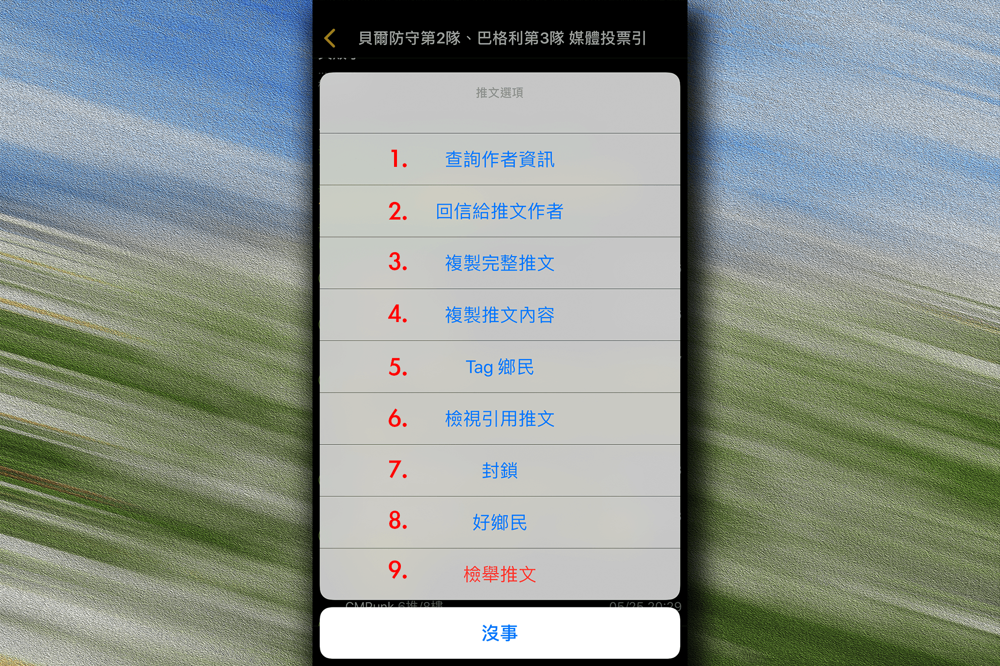 

1. ### 查詢作者資訊
點擊後將顯示作者資訊頁面。

2. ### 回信給推文作者
由 App 自動帶入收件者、標題等其他資訊的寄發新信件功能

3. ### 複製完整推文
複製包含ID與推、噓、箭頭等資訊的完整推文

4. ### 複製推文內容
僅複製推文內容

5. ### Tag 鄉民
成功送出推文後將推播通知給Tag到的使用者，對方不需為登入狀態，  
只要有安裝 PiTT 即可接收通知

6. ### 檢視引用推文
可查看推文中提到指定樓層或使用者的推文

7. ### 封鎖
將推文者加入封鎖名單，所有文章、信件、推文、水球以及話題皆會被封鎖，被封鎖的項目會顯示為淡化項目  
此處之所以不完全隱藏項目，是為避免造成 App 有刻意隱藏特定資訊的疑慮  
所有封鎖項目皆可隨時查閱或解除封鎖

8. ### 好鄉民
將推文者加入好鄉民名單，推文前方將顯示愛心圖示，同時加入封鎖及好鄉民表示為超級好友，除了不會顯示為封鎖狀態外，推文前方將顯示特殊圖示。

9. ### 檢舉信件
將違規推文通報給管理者，由於信件只能到 Violation 看板檢舉，點擊後將僅顯示提示。  
  
[返回頁首](#操作手冊) 

## 預覽項目

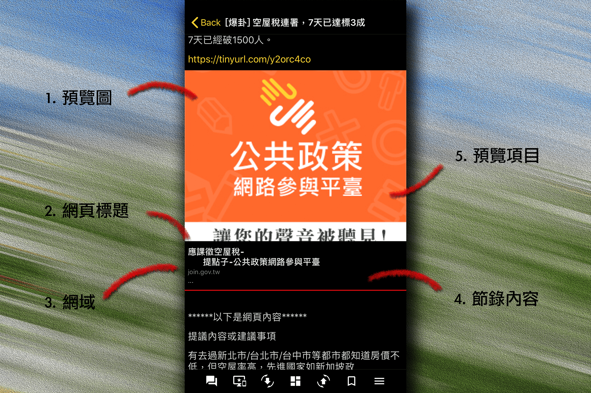 

1. ### 預覽圖
網址的預覽圖片，若為圖片網址則為圖片內容

2. ### 網頁標題
網址的網頁標題

3. ### 網域
此網址的到達網頁所在網域

4. ### 節錄內容
此網址的部分內容

5. ### 預覽項目功能
點擊可開啟網址，長按可顯示預覽項目選項，支援 3D Touch  
  
[返回頁首](#操作手冊) 

## 預覽項目選項

 

1. ### 開啟
開啟網址

2. ### 加入閱讀列表
加入 Safari 閱讀列表

3. ### 拷貝
複製網址

4. ### 分享...
分享網址

5. ### 儲存圖片
儲存網址預覽圖片

6. ### 大圖瀏覽功能
進入大圖瀏覽頁面

7. ### 移除/加入 SafariVC 例外清單
將此網址加入 SafariVC 例外清單在開啟以 SafariVC 瀏覽網頁時可以忽略此網址，  
避免有對應 App 可開啟時無法導向至該 App  
  
[返回頁首](#操作手冊) 

## 網址項目

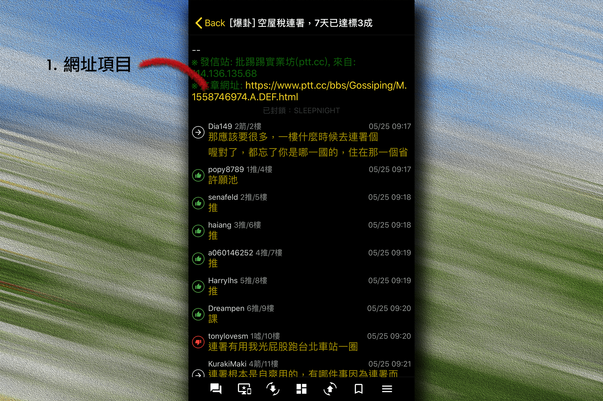 

1. ### 網址項目功能
點擊後顯示網址選項  
  
[返回頁首](#操作手冊) 

## 網址項目選項

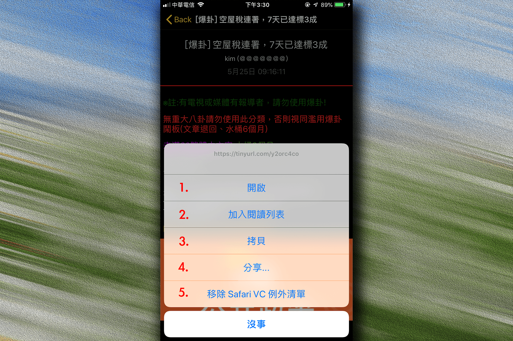 

1. ### 開啟
開啟網址

2. ### 加入閱讀列表
加入 Safari 閱讀列表

3. ### 拷貝
複製網址

4. ### 分享...
分享網址

5. ### 移除/加入 SafariVC 例外清單
將此網址加入 SafariVC 例外清單在開啟以 SafariVC 瀏覽網頁時可以忽略此網址，  
避免有對應 App 可開啟時無法導向至該 App  
  
[返回頁首](#操作手冊) 

## 文章代碼項目

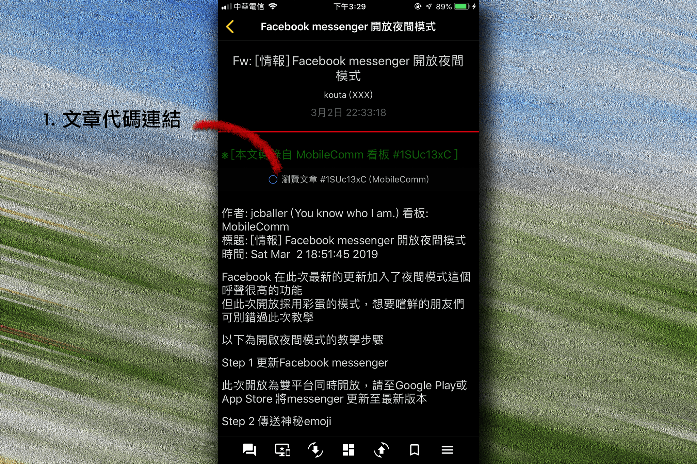 

1. ### 文章代碼連結
點擊後進入此代碼連結之文章內容，若此代碼不包含看板則會進入本看板相同代碼的文章  
  
[返回頁首](#操作手冊) 

## 剪貼簿

 

此頁面專門用來複製文字，為讓使用者更方便複製完整內容而不被圖片預覽項目或推文格式阻礙，  
因此顯示此複製用頁面，文字大小套用 ANSI 模式之文字大小設定  
**此介面非ANSI模式**  
  
[返回頁首](#操作手冊) 

## 文章內容瀏覽模式

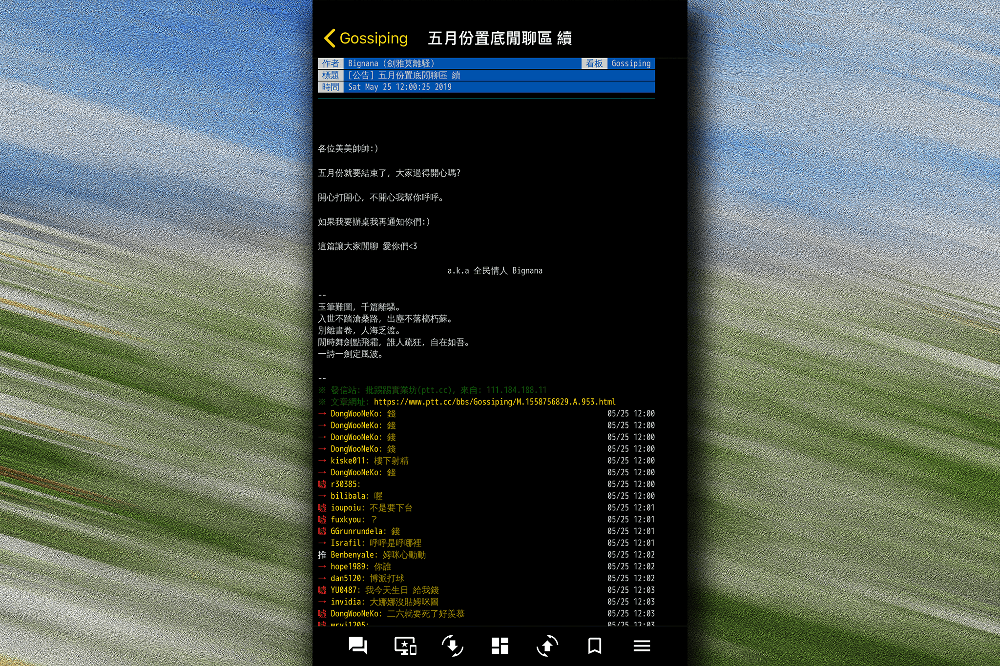 

文章內容介面有兩種瀏覽模式  

* ANSI 模式為可完整顯示 PTT 原始畫面的瀏覽模式，如查看 Ansi Art 時可切換  
* MOBI 模式為針對行動裝置最佳化的瀏覽模式，可預覽圖片與多樣功能  
  
[返回頁首](#操作手冊) 

## 推文頁面

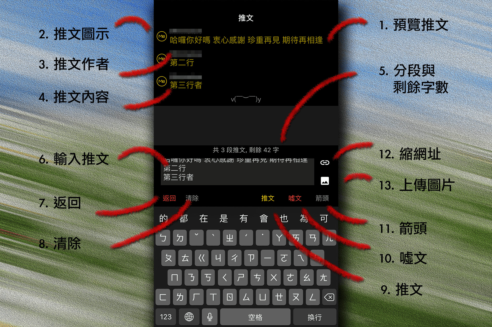 

1. ### 預覽推文
此處將預覽推文送出結果，可方便地檢視分段後的推文是否流暢

2. ### 推文圖示
此處一律顯示我的推文圖示

3. ### 推文作者
此處一律顯示目前登入帳號

4. ### 推文內容
預覽推文內容

5. ### 分段與剩餘字數
顯示目前分為幾段推文，這一樓層的推文還剩幾個字會自動分段

6. ### 輸入推文
輸入要發送的推文，可以使用換行符號手動分段

7. ### 返回
取消推文，若尚有推文未送出將自動儲存草稿，關閉 App 後消失

8. ### 清除
清除已輸入的推文

9. ### 推文
以推文方式送出，此按鈕會根據目前是否能夠推文改變顯示狀態，  
一般來說，推文皆有冷卻時間，在一段時間內無法重複推文，  
此時推文按鈕便會隱藏

10. ### 噓文
以噓文方式送出，此按鈕會根據目前是否能夠噓文改變顯示狀態，  
一般來說，噓文皆有冷卻時間，在一段時間內無法重複噓文，  
此時噓文按鈕便會隱藏，  
另外，某些看板會將噓文功能關閉，  
此時噓文按鈕也會隱藏

11. ### 箭頭
以箭頭方式送出，此按鈕會根據目前是否能夠箭頭方式發送推文改變顯示狀態，  
一般來說，箭頭沒有冷卻時間，因此會一直顯示

12. ### 縮網址功能
進入縮網址功能頁面

13. ### 上傳圖片
上傳圖片後將顯示圖片網址  
  
[返回頁首](#操作手冊) 

## 大圖瀏覽

可瀏覽原圖大小的功能，左右滑動切換圖片，下滑關閉頁面。  

 

1. ### 關閉
關閉頁面

2. ### 分享
分享圖片網址

3. ### 雙擊放大/縮小
點擊後將放大圖片，若為以放大狀態則會還原為預設大小

4. ### 兩指縮放
可使用兩指縮放圖片  
  
[返回頁首](#操作手冊) 

## 精華區列表

 

1. ### 精華項目
點擊進入目錄或文章，由於手機版實作限制，  
在進入之前無法得知此路徑是否有下一層目錄或文章，  
因此每次點擊都會嘗試讀取目錄或文章，  
並顯示對應的介面。  
長按顯示選項

2. ### 標題
精華項目標題

3. ### 收錄日期/收錄者
精華文章或目錄被收錄的日期以及收錄者，  
因此列表上顯示的帳號大多時候不等於發文者帳號

4. ### 項目類型與序號
精華區項目類型與項目序號，  
由於類型有例外情況，  
無法以此判斷是否為目錄或文章，  
請僅當作參考即可  
  
[返回頁首](#操作手冊) 

## 精華區選項

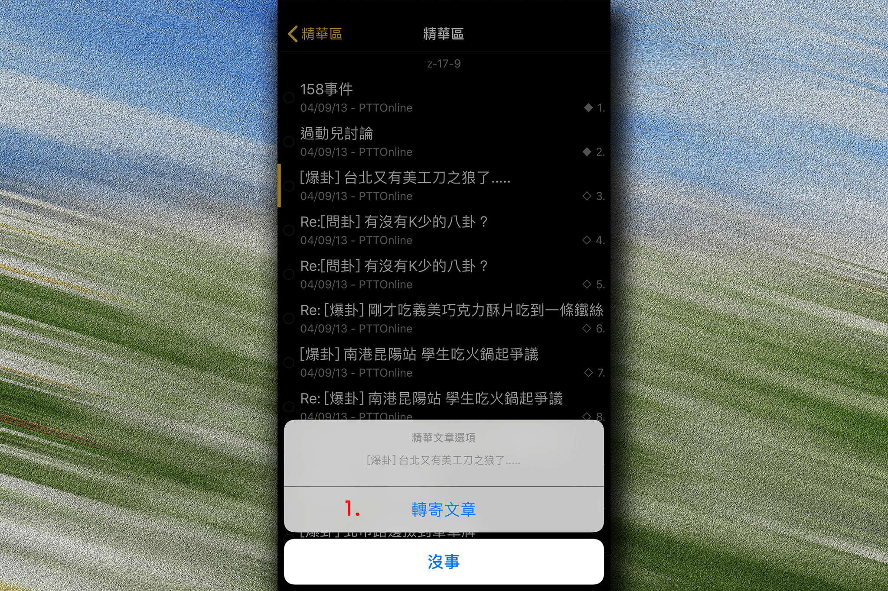 

1. ### 轉寄文章
將精華區文章轉寄至信箱，  
若為目錄則無法轉寄  
  
[返回頁首](#操作手冊) 

## 精華區路徑

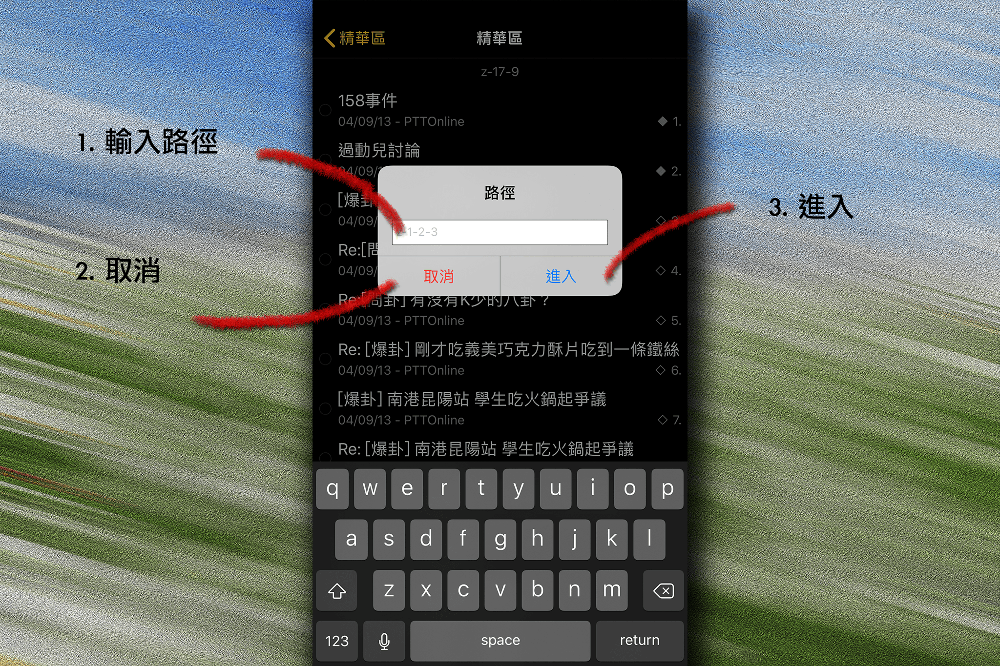 

1. ### 輸入路徑
輸入目錄路徑或文章路徑，  
可快速進入指定目錄或文章

2. ### 取消
關閉路徑功能

3. ### 進入
點擊後進入指定路徑  
  
[返回頁首](#操作手冊) 

## 主選單頁面

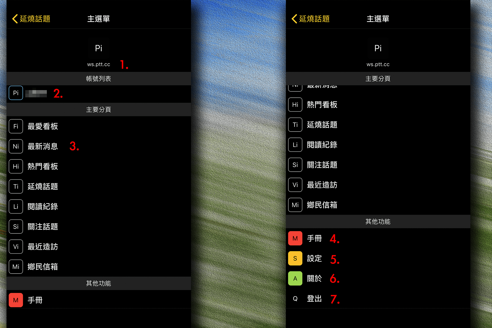 

1. ### 連線位址
目前的連線位址

2. ### 帳號列表
PiTT 紀錄的所有帳號，目前登入中的帳號將顯示為突顯顏色，  
點擊可顯示帳號選項

3. ### 分頁項目
目前啟用的所有分頁，點擊可快速導向該分頁

4. ### 手冊
點擊後開啟操作手冊

5. ### 設定
點擊後開啟設定

6. ### 關於
點擊後開啟關於頁面

7. ### 登出
點擊後登出目前帳號，可登入其他分身帳號、重新登入或是關閉 App  
  
[返回頁首](#操作手冊) 

## 帳號選項

 

1. ### 以此帳號重新連線
點擊後可重新連線，若遇到問題，可使用此功能簡單排除

2. ### 查詢帳號資訊
點擊後將顯示帳號資訊頁

3. ### 設為主帳號
主帳號將在 App 啟動時自動登入，若已設為主帳號，將顯示為取消主帳號功能

4. ### 刪除帳號
將刪除紀錄的帳號、密碼、閱讀紀錄並停止此帳號相關的所有推播通知  
  
[返回頁首](#操作手冊) 

## 發表文章

<iframe width="560" height="315" src="https://www.youtube.com/embed/pgqsc3yfZIk" frameborder="0" allow="accelerometer; autoplay; encrypted-media; gyroscope; picture-in-picture" allowfullscreen></iframe>

  
  
[返回頁首](#操作手冊) 

## 回覆文章

<iframe width="560" height="315" src="https://www.youtube.com/embed/7-72P-vAjPM" frameborder="0" allow="accelerometer; autoplay; encrypted-media; gyroscope; picture-in-picture" allowfullscreen></iframe>

  
[返回頁首](#操作手冊) 

## 編輯簽名檔

<iframe width="560" height="315" src="https://www.youtube.com/embed/F-ZFCgcboe8" frameborder="0" allow="accelerometer; autoplay; encrypted-media; gyroscope; picture-in-picture" allowfullscreen></iframe>

    
[返回頁首](#操作手冊) 

## 編輯文章

<iframe width="560" height="315" src="https://www.youtube.com/embed/XGUdDIv9Lqg" frameborder="0" allow="accelerometer; autoplay; encrypted-media; gyroscope; picture-in-picture" allowfullscreen></iframe>

      
[返回頁首](#操作手冊) 

## 從暫存檔恢復

<iframe width="560" height="315" src="https://www.youtube.com/embed/OAW2u5i_h2c" frameborder="0" allow="accelerometer; autoplay; encrypted-media; gyroscope; picture-in-picture" allowfullscreen></iframe>

        
[返回頁首](#操作手冊) 

----

## 簡介

PTT 為 BBS 站台，原始連線方式需使用個人電腦的終端機才能連線，  
後來出現了 PCMAN 等更加方便的電腦版客戶端，  
讓鄉民可以更便捷的瀏覽 PTT。  

PiTT 為第三方手機版瀏覽器，由於現今社會大眾傾向於使用手機上網，  
是為了讓鄉民能享用更加的使用者體驗以及更直覺的介面設計而開發的 App。  
  
[返回頁首](#問與答) 

## 連線方式

PTT 的連線方式有很多種

1. Telnet 
2. SSH
3. WebSocket

Telnet 是使用明碼傳輸，也就是有心人只要想就能知道你與伺服器間傳輸的所有資訊
速度最快，安全性最低，也是大多數 App 的預設連線方式

SSH 是使用加密傳輸，速度一般，安全性高，也是 PiTT 的預設連線方式

WebSocket 有加密傳輸與明碼傳輸，PiTT 使用的是加密傳輸，速度一般，安全性高  
  
[返回頁首](#問與答) 

## 無法登入

1. 重複登入帳號數量過多(3個)，若出現刪除重複登入提示請選擇刪除
2. 請到設定 - 連線 開啟僅使用 ptt.cc 位址連線(若有在中國使用請關閉) 
3. 網路環境無法使用 SSH 連線(port 22)，請確定使用的網路環境可以使用 SSH 連線
4. 被手機內安裝的系統管理應用程式阻擋，例如防火牆，背景服務限制管理，OperaMax ，擋廣告 App 等等(某些版本會導致頻繁斷線，可在 MobileComm 看板搜尋相關案例
)，Android 系統的限制背景連線也可能導致無法連線
5. PTT 伺服器維護中/過載
6. 重新開機重置裝置所有連線（台哥大、遠傳常使用到被 PTT 封鎖的 IP 位址導致無法連線）
7. 更換連線功能（SSH/WSS）
  
[返回頁首](#問與答) 

## 連線緩慢

#### 給懶得看的人的快速結論就是到設定內改為使用WebSocket連線
#### 測試最高紀錄為一秒內登入完成
#### 最主要的影響還是PTT伺服器本身

PTT 的連線方式有很多種

1. Telnet 
2. SSH
3. WebSocket

Telnet 是使用明碼傳輸，也就是有心人只要想就能知道你與伺服器間傳輸的所有資訊
速度最快，安全性最低，也是大多數 App 的預設連線方式

SSH 是使用加密傳輸，速度一般，安全性高，也是 PiTT 的預設連線方式

WebSocket 有加密傳輸與明碼傳輸，PiTT 使用的是加密傳輸，速度一般，安全性高

說了這麼多，為什麼會有人覺得 PiTT 登入慢，有人覺得 PiTT 登入快呢？

#### 重點來了

主要是因為在 SSH 連線方面 PTT 站台有限制登入處理的數量，  
在同一時間登入人數過多時就會需要等待，  
直到前面的人登入完畢  

舉例來說 當處理上限為一百人 而你是第一百零一個登入的人，  
你必須等待到第一個人登入成功後 PTT 才會開始處理你的登入動作，  
同時第一百零二個人順位就往前移動一個位子，  
這就是為什麼 PiTT 在某些時候不容易登入的原因，  
就是因為人太多而受限於站台本身的行為  

要解決這個問題只要到設定內修改為使用 WebSocket 連線即可  

那為什麼不設定為預設連線呢？  
因為站方目前還是把這項連線方式定位為實驗階段，  
如果設為預設連線而站方停止測試，  
那還不知道有連線方式可以調整的鄉民就會覺得 PiTT 壞掉了  

#### 關於重複登入

另外提供一個有關重複登入的資訊  

PTT 允許的重複登入連線只有三個，  
超過這個數量再選擇「允許重複登入」那個瞬間就會把你目前登入中的連線斷線，  
所以在連線失敗連續超過三次時 PiTT 就會強制跳出重複登入選項以供使用者選擇「不允許重複登入」，  
避免使用者卡在登入 - 被斷線的循環  

而在選擇不允許重複登入的時候常常有人覺得這裡卡很久，  
其實這也是 PTT 站台本身的限制，  
但我也不清楚 PTT 在處理哪些資訊，  
可能是重複登入帳號間的資訊同步作業讓這個動作花了些時間

以上就是關於登入的小知識  
  
[返回頁首](#問與答) 

## 樓層數消失

PTT 本身沒有支援樓層顯示，  
應用程式內的樓層數與推噓數都是由程式自行計算出來的，  
使用 End 之後是由文章最末頁開始讀取，  
因為無法讀取到第一樓所在位置，  
所以沒辦法計算樓層數為多少，  
推文後預設以 End 重新整理，  
因此同樣無法顯示樓層數，  
Home 則是重新整理後由文章第一頁開始讀取，  
所以可以依序計算樓層數與推噓數  
  
[返回頁首](#問與答) 

## 點擊文章與進入文章不符

如果是搜尋推文數狀態下點擊文章的確會出現這個問題喔，  
因為 PTT 的文章序號不是固定值，  
而推文數搜尋的異動情況也比較多，  
所以如果搜尋結果有異動就很可能造成點擊文章與進入文章不一致的情形，  
例如原本搜尋 50 推以上有 5 篇文章，  
但在手機上顯示結果後 PTT 伺服器多了 3 篇 50 推以上的文章，  
而這幾篇文章的時間又比較新的話就會改變其他文章的序號，  
這個算是手機版實作上的一個限制，  
不過只要重新整理後就可以恢復正常了  
  
[返回頁首](#問與答) 

## 回覆推文

PTT 本身沒有回覆推文功能，  
一般都是使用編輯文章功能自行在推文下方輸入回覆文字，  
編輯文章介面可以從文章內容介面展開按鈕後點擊「編輯文章」進入，  
長按推文後會顯示編輯介面，  
在推文日期後方輸入換行符號再輸入回覆文字即可，  
編輯完成後 PiTT 會顯示預覽並檢查是否有將推文改壞掉，  
不過編輯功能有點複雜，  
建議可以到 Test 看板熟悉編輯功能操作後再行使用，  
包括標記、刪除、回復上一個編輯版本等等  
  
[返回頁首](#問與答)  

## 發文或推文出現亂碼

發文、推文出現亂碼！！！  

最近偶爾會看到出現亂碼的文章或推文，  
然後底下就有鄉民推文開玩笑說：一定是用XXX發文的！  
之前也有一些使用者有回報出現亂碼的問題，  
乾脆在這裡再發一篇較完整的說明。  
  
其實，不管使用的是哪一款 PTT 瀏覽器，  
只要您輸入的文字是 PTT 系統本身不支援的字元，  
就會出現亂碼。  
也就是說，如果您輸入了某些"罕用字"就會造成亂碼的情形，  
即使您使用的是家喻戶曉的 PCMAN 也一樣，  
但 PCMAN 是即時顯示 PTT 回傳的內容，  
所以在輸入或貼上時就會立即出現亂碼或是根本無法輸入。  
  
最常出現此情形的是使用超注音的使用者，  
可能應用程式本身預設就有開啟罕用字的支援，  
而在自動選字時又會將罕用字排在第一順位(跟使用者自選詞也有關係，不能說全是超注音的問題)，  
所以常常出現此情形，  
最常見的例子，就是之前使用者回報的 "會" 與 "㑹" 兩個字，  
前者是 PTT 有支援的字元，後者是 PTT 不支援的字元，  
特別的是，PTT 是使用雙位元組呈現寬字元(也就是中文字)，  
而 PTT 看不懂的字元在輸出時就會將字元位元組隨意組合再輸出，  
因為正確的編碼被拆掉了，  
在頁面上原本 "㑹" 字本身以及其前後的文字就可能會呈現為亂碼，  
PCMAN 使用者可以在推文時試者貼上 "哈會哈" 與 "哈㑹哈" 看看差異，  
"㑹" 字後方搭配不同文字各有不同樂趣。  
以更簡單的例子來說，  
就是強迫一個不懂英文的人唸一段句子一樣，看不懂他就會亂念。  
  
基於以上原因，  
只要使用者從輸入法設定內將罕用字支援關閉就不太會出現此情形了，  
有些例外是當使用者從網頁直接複製貼上內容時也會出現亂碼，  
這個情形可能是複製的文字內容中也包含了某些不會顯示同時 PTT 也不支援的字元在內，  
這點就只能請使用者自行注意囉  
  
[返回頁首](#問與答) 

## 實名發布

實名發布為沿用PTT的名詞，  
這裡的「實名」是指是否要在發文時顯示ID，  
只有在匿名看板有作用，  
因為匿名看板有規定某些分類的文章必須顯示ID發文，  
此時就需要勾選實名發布，  
一般看板預設發文時就會顯示ID，  
所以有沒有勾選都沒有影響  

[返回頁首](#問與答) 

## 信件通知

#### 請開啟 App 通知權限

PTT 的信件通知與水球通知不一樣，  
只有在頁面切換時才會顯示在畫面上方，  
因此只有在操作 PTT 時才有辦法讀取通知，  
例如讀取文章、看板列表、文章列表等等，  
若在通知已顯示的情況下，  
必須要在讀取最新的信件內容後才會重設通知檢查狀態，  
其他 app 都是在背景固定一段時間自動連線至 PTT 檢查才有辦法主動通知，  
但此方法會佔用 PTT 過多資源，  
由於 PTT 沒有向開發者收費，  
所以會盡量避免加入這類背景自動讀取資料的功能，  
避免造成伺服器忙碌而影響到其他使用者登入使用的權利。  
  
PiTT 有另外加入「即時信件通知」功能，  
只要對方使用 PiTT 發信，  
有安裝 PiTT 的使用者就能即時收到信件通知  
  
[返回頁首](#問與答) 

## 無法開啟測試版本

iOS Beta (TestFlight)的每一個版本都只有90天的使用期限(自上傳送審日起算)，  
因此請盡量維持最新版本，  
另外若更換裝置或是使用 iCloud 復原裝置都可能導致 TestFlight 憑證錯誤，  
此時只要移除 TestFlight 與相關 app 後再重新安裝即可  

[返回頁首](#問與答) 

## 封鎖樣式

不完全隱藏黑名單是為了避免 App 刻意隱藏某些特定資訊的疑慮，   
若有顯示隱藏哪些項目，可以讓使用者更安心，   
另外一點則是方便使用者隨時解除隱藏狀態，   
除了永久解除封鎖，PiTT 還有暫時解除封鎖跟超級好友（同時加入封鎖與好鄉民），   
這些功能都需要保留封鎖項目才會更方便。   

若真的不想在推文看見某些帳號，   
可以查詢該位鄉民後編輯「別名」項目，   
即可替代帳號顯示。

[返回頁首](#問與答) 

## 點擊狀態列不會回到頂部

iOS 點擊狀態列的功能實際上為「回到第一列」的功能，  
但因為 iOS 的元件本身沒有支援反向瀏覽，  
導致沒有使用者用過從下方開始載入資料的 App，  
所以讓使用者誤以為此功能為回到頂部。  
PiTT 使用反序列表或文章內容的 End 功能後都是從下方開始載入資料，  
因此點擊狀態列會回到最下方（第一列）才是正常的情況

[返回頁首](#問與答) 